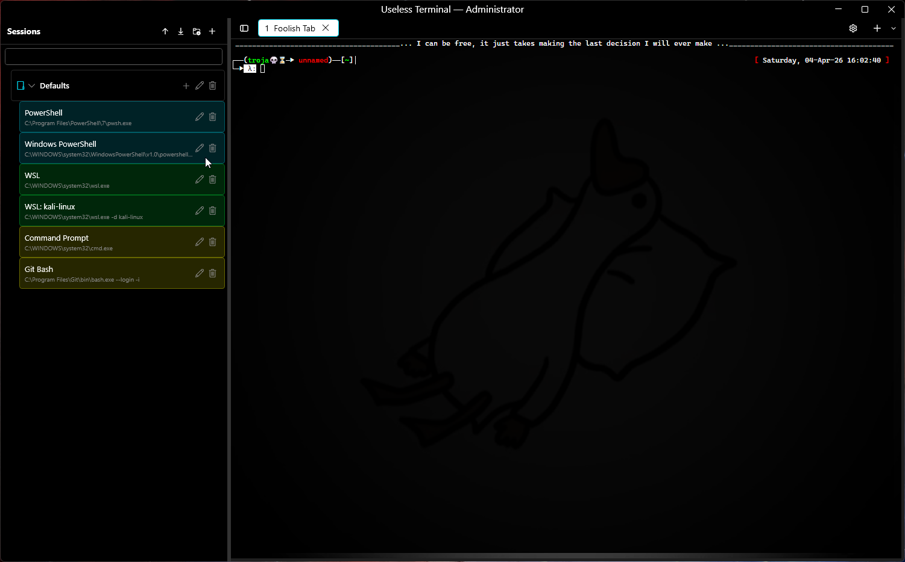
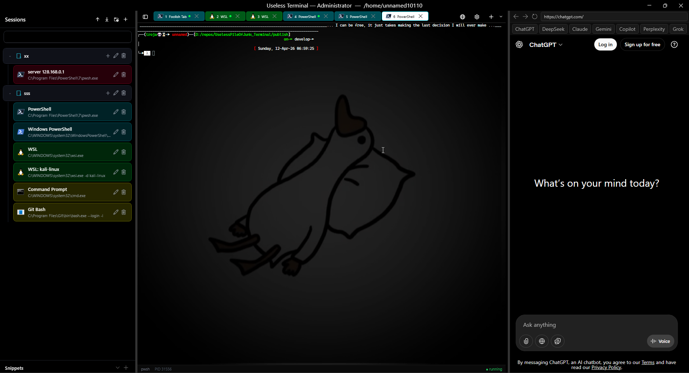
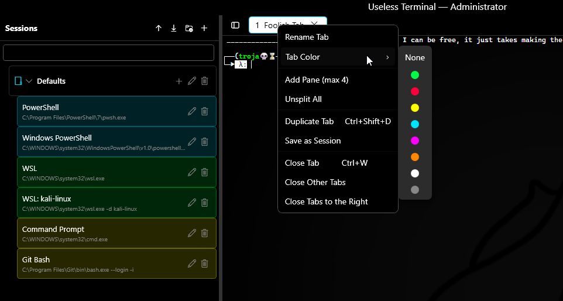
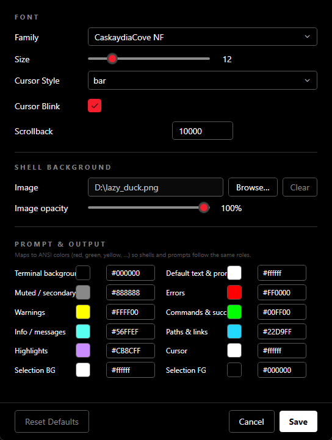
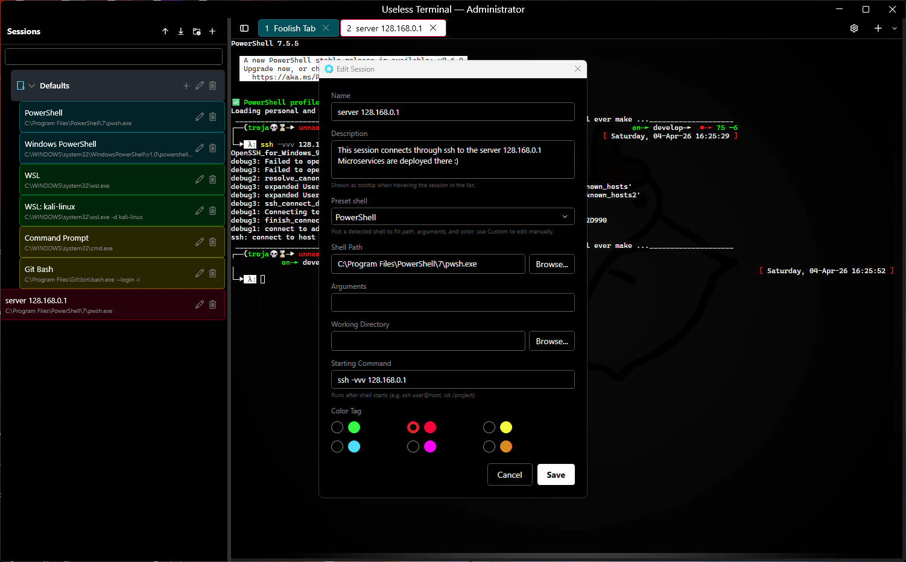
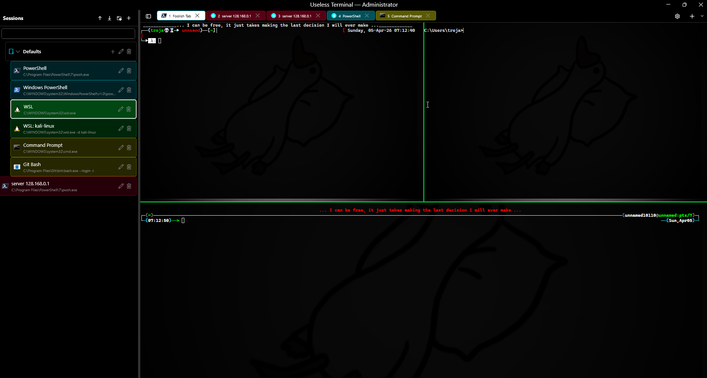

# Useless Terminal

A fast Windows terminal frontend wrapper built with WPF + WebView2 + xterm.js, featuring a toggleable session management panel inspired by MobaXterm, a built-in AI browser panel, and power-user features like workspaces, shell integration, session recording, and fully configurable keybindings.

## Features

### Core Terminal
- **GPU-accelerated terminal** via xterm.js WebGL renderer in WebView2
- **ConPTY backend** for native Windows pseudo-console support
- **Tabbed interface** with close buttons, shell selector dropdown, per-tab highlight colors, pin, rename, drag-reorder
- **Split panes** — up to 4 panes per tab with keyboard-driven focus navigation
- **Auto-detects shells**: PowerShell 7, Windows PowerShell, CMD, WSL distros, Git Bash

### Session Management
- **Session panel** (Ctrl+B) for saving, editing, and launching terminal sessions in a hierarchical tree view with indent guide lines
- **Session folders**: organize sessions in a tree; drag-and-drop to reorder or move between folders and root
- **Per-session theme overrides** — custom background color and font size per saved session
- **Per-session environment variables** — KEY=VALUE overrides injected into the shell process
- **Session import/export** (JSON) and **import from Windows Terminal** / SSH config profiles
- **Snippets**: save and quick-send frequently used commands

### Workspace & Productivity
- **Startup workspace profiles** — save your current tabs as a named workspace, reload via command palette
- **Command palette** (Ctrl+Shift+P) — quick access to all features
- **Quick SSH connect** (Ctrl+Shift+O) — connect via `user@host:port` without creating a saved session
- **Quake mode** (Win+\`) — global hotkey to toggle window visibility
- **Broadcast input** — type into all panes simultaneously
- **Tab groups** — assign named group labels to tabs

### Browser Panel
- **Built-in web browser** (Ctrl+Shift+B) — a toggle side panel on the right with a full WebView2 browser
- Quick-access buttons for ChatGPT, DeepSeek, Claude, Gemini, Copilot, Perplexity, and Grok
- Address bar with URL and Google search support; back/forward/refresh navigation
- Separate profile so logins and cookies persist independently

### Search
- **Search buffer** (Ctrl+Shift+F) with match highlighting and previous/next navigation
- **"All tabs" checkbox** — broadcast search to every open tab simultaneously
- **Clickable file paths** — Windows and Unix paths in terminal output are clickable; opens files in VS Code, directories in Explorer

### Shell Integration
- **OSC 7** — tracks current working directory
- **OSC 133** — detects prompt markers from oh-my-posh/starship/PowerShell for per-command exit code display in the status bar

### Status Bar
- Bottom bar showing: shell name, PID, current working directory, git branch, last command exit code, and running/exited status

### Logging & Recording
- **Session logging** — per-tab toggle to log output to timestamped files with ANSI stripping (`%APPDATA%/UselessTerminal/logs/`)
- **Terminal recording** — record in asciicast v2 format (`.cast`) for replay on asciinema.org (`%APPDATA%/UselessTerminal/recordings/`)

### Visual & Fun
- **Theme presets** with customizable ANSI colors, font, cursor, scrollback, and background image
- **Window backdrop**: None, Mica, or Acrylic
- **Retro CRT mode** — scanlines, screen curvature, phosphor glow, and flicker
- **Minimap scrollbar** — VS Code-style compressed scrollback overview with click-to-jump
- **Font zoom** (Ctrl+scroll) with persistence

### Protection & Notifications
- **Read-only mode** — lock a tab from keyboard input (lock icon in tab header)
- **Command completion notifications** — taskbar flashes when a long-running command finishes while the window is unfocused
- **Close confirmation** when tabs are still running

### Settings & Configuration
- **Settings UI** (`%APPDATA%/UselessTerminal/settings.json`) — colors, font, cursor, scrollback, background image, window backdrop
- **Custom keybindings** (`%APPDATA%/UselessTerminal/keybindings.json`) — all shortcuts are user-configurable
- **Window state persistence** — position, size, session panel state, and open tabs are restored on launch

## Keyboard Shortcuts

All shortcuts are configurable via `keybindings.json`.

| Shortcut | Action |
|---|---|
| Ctrl+B | Toggle session panel |
| Ctrl+Shift+B | Toggle browser panel |
| Ctrl+T | New tab (default shell) |
| Ctrl+W | Close current tab / pane |
| Ctrl+Tab | Next tab |
| Ctrl+Shift+Tab | Previous tab |
| Ctrl+1–9 | Switch to tab N |
| Ctrl+Shift+N | New session dialog |
| Ctrl+Shift+D | Duplicate tab |
| Ctrl+Shift+P | Command palette |
| Ctrl+Shift+O | Quick SSH connect |
| Ctrl+Shift+F | Search buffer |
| Ctrl+Shift+S | Export buffer to file |
| Ctrl+Shift+C / V | Copy / Paste |
| Ctrl+Shift+Arrow | Move pane focus |
| Ctrl+, | Open settings |
| Ctrl+Scroll | Zoom terminal font |
| Win+\` | Quake mode (toggle window) |

## Usage
- Terminal appearence



- Side-Helper



- Add any default shell


- Tab options



- Terminal Settings



- Custom new session


- Start command example



- Splitted panes



## Requirements

- Windows 10 version 1809+ (for ConPTY)
- .NET 9 SDK
- WebView2 Runtime (pre-installed on Windows 10 21H2+ and Windows 11)

## Build & Run

```bash
dotnet build UselessTerminal.sln -c Debug
dotnet run --project src/UselessTerminal
```

### Standalone publish (repository root)

From the repo root, `build.bat` publishes a **self-contained** `win-x64` app to the `publish` folder (see script for options).

## Architecture

```
WPF App (Fluent theme via WPF-UI)
├── Session Panel (XAML sidebar, tree + folders + snippets)
├── Tab Bar (custom TabControl with groups, pin, drag-reorder)
├── Terminal Panes (up to 4 per tab)
│   └── WebView2 Control
│       └── xterm.js (WebGL GPU renderer + addons)
│           ├── Search, Web Links, Image, Unicode11
│           └── ConPTY (via P/Invoke)
├── Status Bar (shell, PID, CWD, git branch, exit code)
├── Browser Panel (WebView2 side browser)
└── Services
    ├── SettingsStore, SessionStore, WorkspaceStore, SnippetStore
    ├── TerminalLogger, AsciicastRecorder
    ├── CommandNotifier, KeyBindingConfig
    └── SshConfigImporter, ShellDetector
```

## Data Storage

All user data lives in `%APPDATA%/UselessTerminal/`:

| File | Purpose |
|---|---|
| `settings.json` | App settings (theme, font, colors, backdrop) |
| `sessions.json` | Saved sessions and folders |
| `workspaces.json` | Workspace profiles |
| `keybindings.json` | Custom keyboard shortcuts |
| `snippets.json` | Saved command snippets |
| `windowstate.json` | Window position, size, open tabs |
| `logs/` | Session log files (ANSI-stripped) |
| `recordings/` | Asciicast v2 recording files |

## Tech Stack

- **UI Framework**: WPF + [WPF-UI](https://github.com/lepoco/wpfui) (Fluent design system)
- **Terminal Renderer**: [xterm.js](https://xtermjs.org/) v5 with WebGL, Search, Web Links, Image, and Unicode11 addons
- **Browser**: WebView2 (Chromium) with separate user data profile
- **Shell Backend**: Windows ConPTY via direct P/Invoke
- **Shell Integration**: OSC 7 (CWD), OSC 133 (prompt markers / exit codes)
- **Storage**: JSON files in `%APPDATA%/UselessTerminal/`

## Credits

- **Developer:** Unnamed10110  
- **Contact:** [trojan.v6@gmail.com](mailto:trojan.v6@gmail.com) · [sergiobritos10110@gmail.com](mailto:sergiobritos10110@gmail.com) (secondary)
